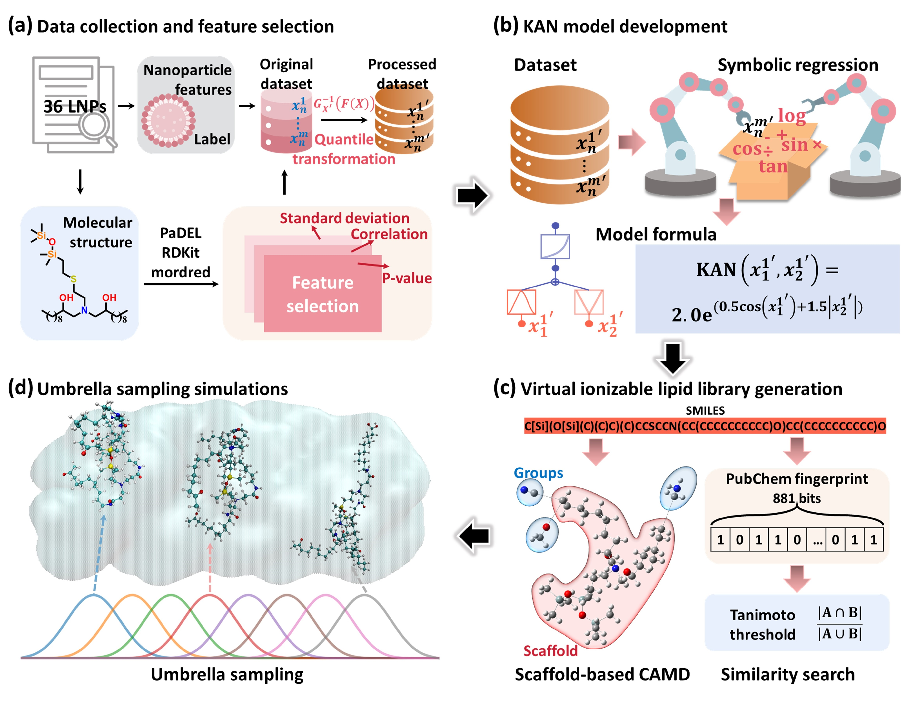

# KAN-LNP: Kolmogorov-Arnold Networks for Ionizable Lipid Design

[](https://www.python.org/downloads/)
[](https://opensource.org/licenses/MIT)

## Overview

This repository contains the implementation of a **small-data-driven computational framework** for the rational design of siloxane-based ionizable lipids in lipid nanoparticles (LNPs), as described in our paper published in the *Journal of Chemical Information and Modeling*.

### Key Features

- **Kolmogorov-Arnold Networks (KANs)**: Symbolic regression-based AI for interpretable predictions
- **Small-data efficiency**: Achieves high accuracy with only 36 training samples
- **Explicit mathematical formulas**: Generates human-readable structure-property relationships
- **Multi-scale integration**: Combines molecular descriptors with nanoparticle features
- **Validation pipeline**: Includes molecular dynamics simulation validation

### Framework Architecture



The framework consists of four sequential components:

1. **Dataset Construction**: Multi-scale feature engineering incorporating molecular descriptors, nanoparticle properties, and experimental delivery efficiency
2. **KAN Model Development**: Symbolic regression to establish quantitative structure-property relationships
3. **Virtual Screening**: Large-scale candidate generation and ranking using trained models
4. **MD Validation**: Umbrella sampling simulations to validate binding affinity predictions

## Abstract

Ionizable lipids are fundamental to the efficacy of lipid nanoparticles (LNPs) in pivotal areas including mRNA vaccines. Their development, however, is hindered by intricate structure-property relationships and limited experimental data. To address these challenges, this study proposed a small-data-driven framework that pioneered the use of Kolmogorov-Arnold networks (KANs)—a symbolic regression-based artificial intelligence (AI) approach—to accelerate the discovery of novel siloxane-based ionizable lipids.

Using only 36 training samples, the resulting KAN model demonstrated high predictive accuracy for mRNA delivery efficiency (Q² = 0.710), outperforming conventional machine learning models by an average absolute improvement of 0.627 in cross-validation and yielding explicit mathematical formulas. Combined with virtual screening and umbrella sampling simulations, the framework identified three candidate lipids with superior predicted performance.

**Keywords**: Lipid nanoparticle, ionizable lipid, machine learning, Kolmogorov-Arnold network, molecular dynamics

## Installation

### Prerequisites

- Python 3.8 or higher

### Dependencies

```bash
pip install -r requirements.txt
```

Core dependencies:
- `torch >= 1.10.0`
- `pykan >= 0.0.1`
- `numpy >= 1.21.0`
- `pandas >= 1.3.0`
- `scikit-learn >= 1.0.0`
- `optuna >= 3.0.0`
- `matplotlib >= 3.4.0`
- `seaborn >= 0.11.0`
- `openpyxl >= 3.0.0`

## Quick Start

### 1. Prepare Your Data

Organize your data in Excel format with the following structure:

```
train.txt:
- Column 1: label (target variable - delivery efficiency)
- Columns 2-N: molecular descriptors and nanoparticle features
```

### 2. Run the KAN Model

```bash
python kan_lnp.py
```

### 3. Customize Parameters

Edit the configuration in `kan_lnp.py`:

```python

# Data transformation
transform_features = True   # Apply quantile transformation to features
transform_label = False     # Apply quantile transformation to labels

```

## Methodology

### KAN Model Architecture

- **Input Layer**: Selected molecular and nanoparticle features
- **Hidden Layer**: Learnable activation functions on edges
- **Output Layer**: Delivery efficiency prediction
- **Symbolic Regression**: Automatic conversion to mathematical formulas


## Citation

If you use this code in your research, please cite our paper:

```bibtex
Zhao Y, Wang J, Song Y, Liu Q, Lin J. Accelerating Siloxane-Based Ionizable Lipid Design for LNPs with Data-Efficient Kolmogorov-Arnold Networks. J Chem Inf Model. 2026 Feb 4. doi: 10.1021/acs.jcim.5c02871. Epub ahead of print. PMID: 41638226.
```

## License

This project is licensed under the MIT License - see the [LICENSE](LICENSE) file for details.

## Acknowledgments

- PyKAN library developers for the KAN implementation
- Optuna team for hyperparameter optimization framework
- All contributors and collaborators

---

**Last Updated**: January 2026
**Version**: 1.0.0
