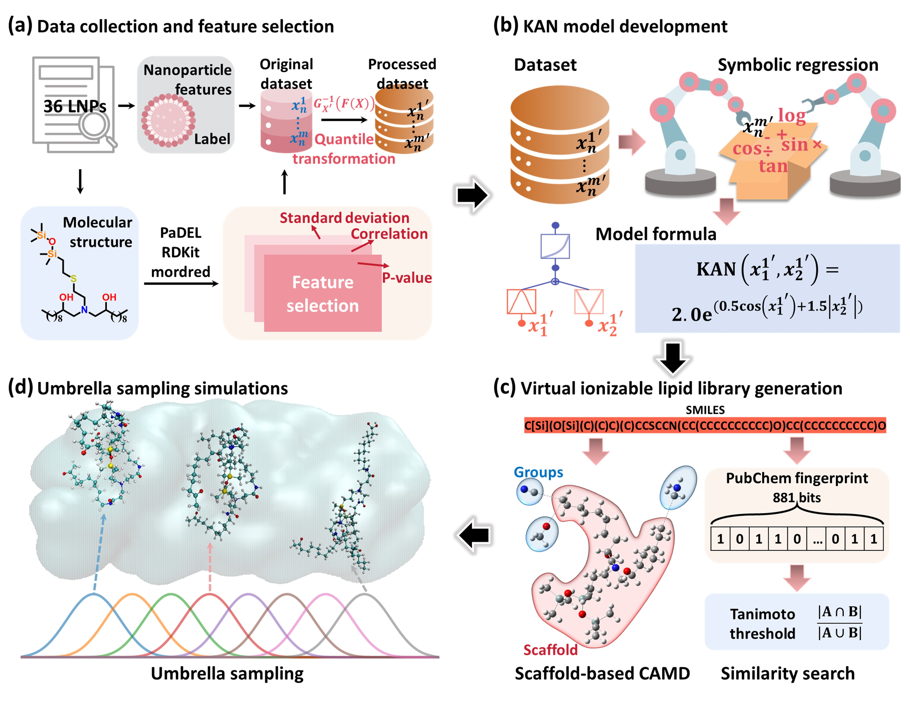

# KAN-LNP: Kolmogorov-Arnold Networks for Ionizable Lipid Design

[](https://www.python.org/downloads/)
[](https://opensource.org/licenses/MIT)
[](https://pubs.acs.org/journal/jcisd8)

## Overview

This repository contains the implementation of a **small-data-driven computational framework** for the rational design of siloxane-based ionizable lipids in lipid nanoparticles (LNPs), as described in our paper published in the *Journal of Chemical Information and Modeling*.

### Key Features

- **Kolmogorov-Arnold Networks (KANs)**: Symbolic regression-based AI for interpretable predictions
- **Small-data efficiency**: Achieves high accuracy with only 36 training samples
- **Explicit mathematical formulas**: Generates human-readable structure-property relationships
- **Multi-scale integration**: Combines molecular descriptors with nanoparticle features
- **Validation pipeline**: Includes molecular dynamics simulation validation

### Framework Architecture



The framework consists of four sequential components:

1. **Dataset Construction**: Multi-scale feature engineering incorporating molecular descriptors, nanoparticle properties, and experimental delivery efficiency
2. **KAN Model Development**: Symbolic regression to establish quantitative structure-property relationships
3. **Virtual Screening**: Large-scale candidate generation and ranking using trained models
4. **MD Validation**: Umbrella sampling simulations to validate binding affinity predictions

## Abstract

Ionizable lipids are fundamental to the efficacy of lipid nanoparticles (LNPs) in pivotal areas including mRNA vaccines. Their development, however, is hindered by intricate structure-property relationships and limited experimental data. To address these challenges, this study proposed a small-data-driven framework that pioneered the use of Kolmogorov-Arnold networks (KANs)—a symbolic regression-based artificial intelligence (AI) approach—to accelerate the discovery of novel siloxane-based ionizable lipids.

Using only 36 training samples, the resulting KAN model demonstrated high predictive accuracy for mRNA delivery efficiency (Q² = 0.710), outperforming conventional machine learning models by an average absolute improvement of 0.627 in cross-validation and yielding explicit mathematical formulas. Combined with virtual screening and umbrella sampling simulations, the framework identified three candidate lipids with superior predicted performance.

**Keywords**: Lipid nanoparticle, ionizable lipid, machine learning, Kolmogorov-Arnold network, molecular dynamics

## Installation

### Prerequisites

- Python 3.8 or higher
- CUDA-capable GPU (optional, for faster training)

### Dependencies

```bash
pip install -r requirements.txt
```

Core dependencies:
- `torch >= 1.10.0`
- `pykan >= 0.0.1`
- `numpy >= 1.21.0`
- `pandas >= 1.3.0`
- `scikit-learn >= 1.0.0`
- `optuna >= 3.0.0`
- `matplotlib >= 3.4.0`
- `seaborn >= 0.11.0`
- `openpyxl >= 3.0.0`

## Quick Start

### 1. Prepare Your Data

Organize your data in Excel format with the following structure:

```
input_data.xlsx:
- Column 1: label (target variable - delivery efficiency)
- Columns 2-N: molecular descriptors and nanoparticle features

nami.xlsx:
- Fixed features that should always be included
- Same structure as input_data.xlsx
```

### 2. Run the KAN Model

```bash
python kan_featsel.py
```

This will:
- Perform feature selection (standard deviation, correlation, p-value filtering)
- Execute k-fold cross-validation
- Optimize hyperparameters using Optuna (optional)
- Generate symbolic formulas
- Save results to `./output/` directory

### 3. Customize Parameters

Edit the configuration in `kan_featsel.py`:

```python
# Feature selection parameters
top_k = 100              # Top k features by standard deviation
corr_threshold = 0.9     # Correlation threshold for feature removal
alpha = 0.05             # P-value threshold

# Cross-validation
k_folds = 5              # Number of folds

# Data transformation
transform_features = True   # Apply quantile transformation to features
transform_label = False     # Apply quantile transformation to labels

# Hyperparameter optimization
enable_optuna = True     # Enable Optuna optimization
n_trials = 500           # Number of optimization trials
```

## Project Structure

```
.
├── README.md                    # This file
├── requirements.txt             # Python dependencies
├── kan_featsel.py              # Main KAN model with feature selection
├── input_data.xlsx             # Input dataset (molecular descriptors + labels)
├── nami.xlsx                   # Fixed features dataset
├── fig_1.jpg                   # Framework architecture diagram
└── output/                     # Results directory (auto-generated)
    ├── final_result.txt        # Final model performance and formula
    ├── formula.pickle          # Serialized symbolic formula
    ├── prediction_plot.png     # Actual vs predicted plot
    ├── best_params.txt         # Best hyperparameters
    ├── optuna_log.txt          # Optimization history
    ├── featsel_full/           # Feature selection results
    ├── cv_splits/              # Cross-validation fold data
    ├── cv_formulas/            # Formulas from each CV fold
    └── trial_results/          # Individual trial results
```

## Methodology

### Feature Selection Pipeline

The framework implements a three-stage feature selection strategy:

1. **Standard Deviation Filtering**: Selects top-k features with highest variance
2. **Correlation Analysis**: Removes highly correlated features (threshold: 0.9)
3. **Statistical Significance**: Filters features based on p-value (α = 0.05)

### KAN Model Architecture

- **Input Layer**: Selected molecular and nanoparticle features
- **Hidden Layer**: Learnable activation functions on edges
- **Output Layer**: Delivery efficiency prediction
- **Symbolic Regression**: Automatic conversion to mathematical formulas

### Cross-Validation Strategy

- **Method**: Random k-fold cross-validation (default: 5 folds)
- **Metric**: Q² (cross-validated R²)
- **Optimization**: Optuna-based Bayesian optimization

### Hyperparameter Search Space

| Parameter | Range | Description |
|-----------|-------|-------------|
| `hid_dim` | [1, 10] | Hidden layer dimension |
| `grid` | [2, 8] | Grid size for spline functions |
| `k` | [1, 5] | Order of spline functions |
| `steps_ori` | [10, 30] | Initial training steps |
| `steps_prune` | [5, 25] | Pruning refinement steps |

## Results Interpretation

### Output Files

1. **final_result.txt**: Contains the final symbolic formula and performance metrics
   ```
   Final Formula: y = 0.5*x_1^2 + 0.3*sin(x_2) - 0.2*x_3
   R²_train: 0.8500
   MAE_train: 0.1234
   Q²_cv: 0.7100
   ```

2. **prediction_plot.png**: Visualization of model predictions vs actual values

3. **formula.pickle**: Serialized SymPy formula for programmatic use

### Performance Metrics

- **R²_train**: Coefficient of determination on training set
- **Q²_cv**: Cross-validated R² (primary metric for model selection)
- **MAE**: Mean absolute error

## Advanced Usage

### Using Pre-trained Models

```python
import pickle
import sympy as sp
import numpy as np

# Load the trained formula
with open('./output/formula.pickle', 'rb') as f:
    formula = pickle.load(f)

# Make predictions
def predict(features):
    """
    features: dict with keys 'x_1', 'x_2', ..., 'x_n'
    """
    subs = {sp.Symbol(k): v for k, v in features.items()}
    return float(formula.evalf(subs=subs))

# Example
result = predict({'x_1': 0.5, 'x_2': 0.3, 'x_3': 0.8})
print(f"Predicted delivery efficiency: {result}")
```

### Batch Prediction

```python
import pandas as pd

# Load new data
new_data = pd.read_excel('new_compounds.xlsx')

# Apply the same feature selection
from kan_featsel import apply_feature_selection
selected_data = apply_feature_selection(new_data, selected_feature_names)

# Predict
predictions = []
for idx, row in selected_data.iterrows():
    features = {f'x_{i+1}': row[col] for i, col in enumerate(selected_data.columns)}
    pred = predict(features)
    predictions.append(pred)

new_data['predicted_efficiency'] = predictions
```

## Citation

If you use this code in your research, please cite our paper:

```bibtex
@article{kan_lnp_2024,
  title={Small-Data-Driven Discovery of Siloxane-Based Ionizable Lipids Using Kolmogorov-Arnold Networks},
  author={[Your Name] and [Co-authors]},
  journal={Journal of Chemical Information and Modeling},
  year={2024},
  publisher={ACS Publications},
  doi={10.1021/acs.jcim.XXXXXX}
}
```

## Contributing

We welcome contributions! Please follow these steps:

1. Fork the repository
2. Create a feature branch (`git checkout -b feature/amazing-feature`)
3. Commit your changes (`git commit -m 'Add amazing feature'`)
4. Push to the branch (`git push origin feature/amazing-feature`)
5. Open a Pull Request

## License

This project is licensed under the MIT License - see the [LICENSE](LICENSE) file for details.

## Contact

For questions or collaborations, please contact:

- **Primary Author**: [Your Name] - [your.email@institution.edu]
- **Lab Website**: [Your Lab URL]
- **Issues**: Please use the [GitHub Issues](https://github.com/yourusername/kan-lnp/issues) page

## Acknowledgments

- PyKAN library developers for the KAN implementation
- Optuna team for hyperparameter optimization framework
- All contributors and collaborators

## Troubleshooting

### Common Issues

**Issue**: `ModuleNotFoundError: No module named 'kan'`
- **Solution**: Install pykan: `pip install pykan`

**Issue**: Out of memory during training
- **Solution**: Reduce `hid_dim` or `grid` parameters, or use CPU instead of GPU

**Issue**: Poor cross-validation performance
- **Solution**: 
  - Increase `n_trials` for better hyperparameter search
  - Adjust feature selection thresholds
  - Check for data quality issues

**Issue**: Formula extraction fails
- **Solution**: Increase `steps_prune` or adjust `lamb_entropy` parameter

## Roadmap

- [ ] Add support for additional molecular descriptors
- [ ] Implement ensemble KAN models
- [ ] Integration with molecular dynamics simulation tools
- [ ] Web interface for easy model deployment
- [ ] Pre-trained models for common lipid scaffolds

---

**Last Updated**: January 2026
**Version**: 1.0.0
